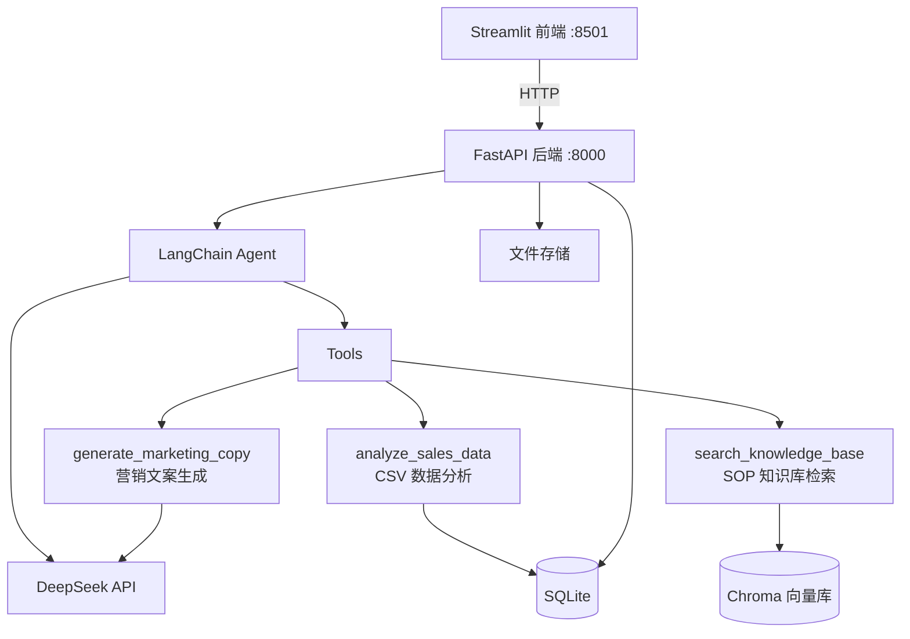

# 🛒 电商智能客服与选品助手 Agent SaaS

[](https://www.python.org/)
[](https://fastapi.tiangolo.com/)
[](https://streamlit.io/)
[](https://www.langchain.com/)
[](https://www.docker.com/)
[](./LICENSE)

> 帮助中小电商团队用自然语言**分析销售数据**、**生成营销文案**、**基于内部 SOP 知识库回答运营问题**。

---

## 📖 项目背景

中小电商团队通常没有专职数据分析师和文案团队，却每天面临这些问题：

- "这周哪个品类卖得最好？利润趋势怎样？"——需要手动查 Excel
- "退货流程怎么写？客服碰到投诉该怎么回复？"——SOP 文档散落在飞书/钉钉里找不到
- "新品上架需要写小红书种草文案"——每次都要从头写

本项目构建了一个**基于 LangChain ReAct Agent 的 AI 助手**，用自然语言对话解决以上所有问题。Agent 能自主判断用户意图，调用对应工具（数据分析 / 知识库检索 / 文案生成），返回结构化结果。

---

## 🏗️ 架构图



---

## ✨ 核心功能

### 💬 对话助手
多轮对话 Agent，能理解上下文，自主决定何时调用工具。支持 3 个 Agent 工具：

| 工具 | 用途 | 示例触发词 |
|------|------|-----------|
| `analyze_sales_data` | CSV 数据 Top N / 利润率 / 趋势 / 分类汇总 | "帮我分析 Top 5 商品" |
| `search_knowledge_base` | RAG 检索 SOP / 客服话术 / 运营规范 | "退货流程是什么" |
| `generate_marketing_copy` | 3 风格 × 3 渠道的营销文案生成 | "写一篇小红书种草文案" |

### 📊 数据上传分析
- 上传 CSV 销售数据 → 自动解析列名和行数
- 自然语言查询 → pandas 计算 → 返回结果 + 图表
- 支持中英文混合列名自动识别

### 📚 知识库管理
- 上传 PDF / DOCX / TXT 文档 → 自动分块 → 向量化存入 Chroma
- 使用 `moka-ai/m3e-base` 中文嵌入模型（768 维）
- 语义搜索 + 相关度评分 + 来源追溯

---

## 🚀 快速开始

### 环境要求

- Python 3.11+
- DeepSeek API Key（[注册获取](https://platform.deepseek.com/)）

### 本地运行

```bash
# 1. 克隆项目
git clone https://github.com/你的用户名/ecommerce-agent-saas.git
cd ecommerce-agent-saas

# 2. 安装依赖
cd backend && pip install -r requirements.txt
cd ../frontend && pip install -r requirements.txt

# 3. 配置环境变量
cp .env.example .env
# 编辑 .env 填入你的 DEEPSEEK_API_KEY
# Windows 用户建议设置 M3E_MODEL_PATH 指向本地 m3e-base 模型

# 4. 启动（双击 start.bat 或手动启动两个终端）
# 终端 1 — 后端
cd backend
$env:M3E_MODEL_PATH="你的本地模型路径"
python -m uvicorn app.main:app --host 0.0.0.0 --port 8000

# 终端 2 — 前端
cd frontend
streamlit run app.py
```

访问 `http://localhost:8501`。

### Docker 部署

```bash
docker-compose up --build
```

> 注意：Docker 环境需要确保 `M3E_MODEL_PATH` 卷挂载正确，或让容器通过 `HF_ENDPOINT` 镜像自动下载模型。

---

## 📁 项目结构

```
├── backend/
│   ├── app/
│   │   ├── main.py              # FastAPI 入口
│   │   ├── config.py            # 环境变量配置
│   │   ├── database.py          # SQLAlchemy 引擎
│   │   ├── models/              # ORM 模型（session, message, uploaded_file）
│   │   ├── schemas/             # Pydantic 请求/响应模型
│   │   ├── routers/             # API 路由（chat, session, upload）
│   │   └── services/
│   │       ├── agent_service.py # LangChain Agent 核心
│   │       ├── csv_service.py   # pandas 数据分析
│   │       ├── rag_service.py   # Chroma RAG 检索
│   │       └── tools/           # Agent 工具定义
│   │           ├── csv_tools.py
│   │           ├── kb_tools.py
│   │           └── copy_tools.py
│   ├── data/                    # 运行时数据（SQLite, 上传文件, Chroma）
│   ├── requirements.txt
│   └── Dockerfile
├── frontend/
│   ├── app.py                   # Streamlit 主入口
│   ├── pages/                   # 三个 Tab 页面
│   │   ├── chat.py
│   │   ├── analysis.py
│   │   └── knowledge.py
│   ├── utils/api_client.py      # FastAPI HTTP 封装
│   ├── requirements.txt
│   └── Dockerfile
├── mock_data/
│   ├── sample_sales.csv         # 模拟销售数据（834 行）
│   └── sample_sop.txt           # 模拟 SOP 文档（7 章）
├── docs/                        # 需求/技术/设计/执行计划文档
├── docker-compose.yml
├── start.bat                    # Windows 一键启动脚本
├── .env.example
└── README.md
```

---

## 🛠️ 技术栈与选型理由

| 技术 | 用途 | 选型理由 |
|------|------|----------|
| Python 3.11 | 全栈语言 | 生态完善，AI/数据工具链成熟 |
| FastAPI | 后端框架 | 高性能异步，自动生成 API 文档 |
| Streamlit | 前端框架 | 纯 Python 写 UI，适合快速原型 |
| LangChain | Agent 框架 | 统一 LLM 调用 + 工具管理 |
| DeepSeek | 大语言模型 | OpenAI 兼容格式，中文能力强，成本低 |
| SQLAlchemy | ORM | 数据库操作抽象，支持 SQLite 无缝升级到 PostgreSQL |
| SQLite | 数据库 | 零配置，适合单机部署 |
| Chroma | 向量数据库 | Python 原生，内置持久化，零运维 |
| m3e-base | 中文嵌入模型 | Moka AI 开源，768 维，中文语义理解好 |
| pandas | 数据分析 | CSV 加载 + 灵活的数据聚合计算 |
| Docker | 容器化 | 一键部署，环境一致性保证 |

---

## 🔮 未来规划

- [ ] 用户认证与多租户隔离
- [ ] PostgreSQL 替代 SQLite（生产环境）
- [ ] 更多 Agent 工具：竞品分析、库存预警、自动选品推荐
- [ ] 定时任务：日报自动生成与推送
- [ ] 支持更多数据源：MySQL 直连、API 数据导入
- [ ] 前端增强：Streamlit 替换为 React（按需）

---

## 📄 License

MIT License — 详见 [LICENSE](./LICENSE) 文件。
